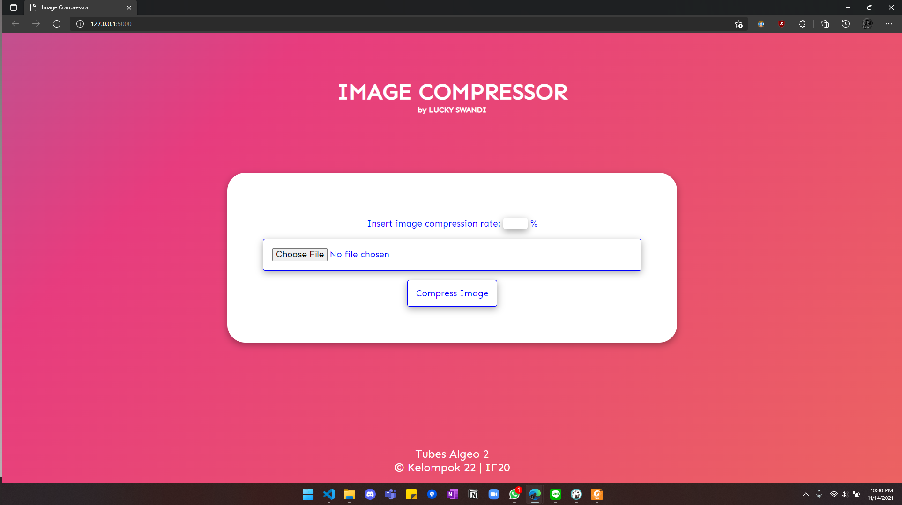

# Image Compressor

## Table of Contents
* [General Info](#general-information)
* [Technologies Used](#technologies-used)
* [Screenshots](#screenshots)
* [Setup](#setup)
* [Usage](#usage)
* [Project Status](#project-status)
* [Room for Improvement](#room-for-improvement)
* [Acknowledgements](#acknowledgements)
* [Contact](#contact)


## General Information
- Image Compressor that uses SVD Algorithm


## Technologies Used
- Tech 1 - Flask
- Tech 2 - HTML
- Tech 3 - CSS
- Tech 4 - Javascript


## Screenshots

<!-- If you have screenshots you'd like to share, include them here. -->


## Setup
- For Backend <br>
```
 python required
 pip install -r requirements.txt  #for python 2
 pip3 install -r requirements.txt #for python 3
```
- For FE <br>
```
 javascript required
```
## Usage

- For frontend we used HTML input to make POST request to Backend

```
<form method="post" action="/" enctype="multipart/form-data" id = "main-form" onsubmit= "resultShow()">
    Insert image compression rate: 
        <input id="compressionRate" type='number' name="compressionRate" min="0"
        max="100" required> %
    <div class="file-input">
        <input type="file" id="image-file" class="image-file" name='image-file' accept="image/*"required> <br>
    </div>
    <input type="submit" value="Compress Image" id="compressButton">
</form>
```

- For backend we uses Flask to manage FE and BE-Algorithm
```
@app.route('/', methods=['POST'])
def uploadImage():
    imageFile = request.files['image-file']
    compressionRate = request.form['compressionRate']

    image  = Image.open(imageFile)
    data = io.BytesIO()
    image.save(data,"PNG")
    encodedImageBefore = base64.b64encode(data.getvalue())

    encodedImageAfter, cTime, pixelDiff = main(imageFile, int(compressionRate)/100)

    return render_template('result.html', imageBefore = encodedImageBefore.decode('utf-8'),imageAfter = encodedImageAfter.decode('utf-8'), pixelPercentage = pixelDiff, compressionTime = cTime)
```


## Project Status
Project is:  _complete_


## Room for Improvement

Room for improvement:
- Improve Algorithm to made the compress run faster
- Improve FE to show before and after image using slider


## Acknowledgements
- Thanks to Allah SWT
- Thanks to Mr. Rinaldi Munir, Mr. Jodhi, and Mr. Rila as our Lecturers
- Thanks to academic assistants
- This project was created to fulfill our Big Project for IF2123 Linear and Geometric Algebra


## Contact
Created by LUCKY SWANDI. 2021 All rights reserved
